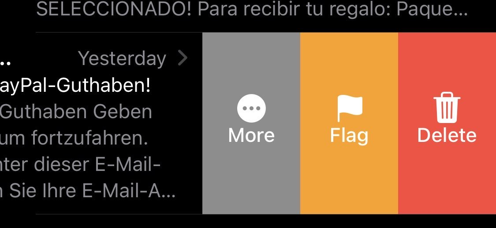
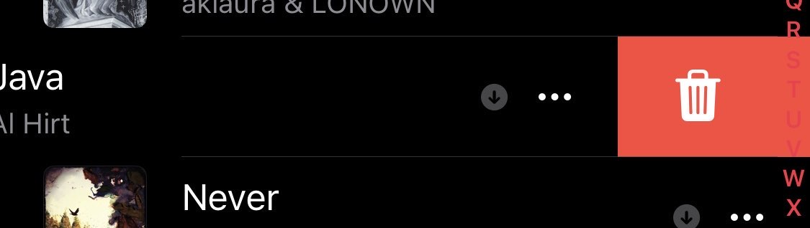
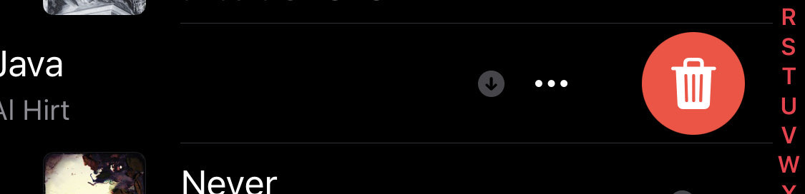
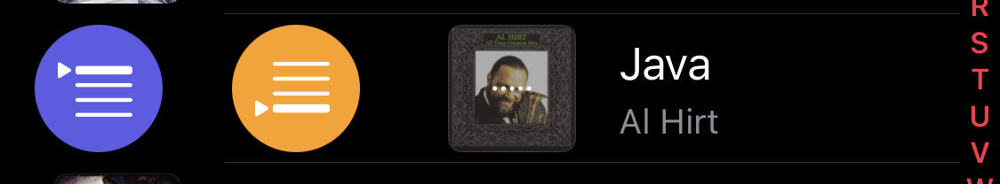

# RoundSwipe

Makes swipe action buttons circular.

## Features

- Circular swipe action buttons
- No configuration needed

## Compatibility

- Tested only on iOS 16.7.11, may be compatible with more versions
- Some apps (e.g. Sileo) use their own implementation, they may gain support in the future

## Bugs

- Missing descriptions e.g. in the clock app when deleting alarms

## Screenshots

| Before | After |
| --- | --- |
|  |  |
|  |  |
|  |  |
